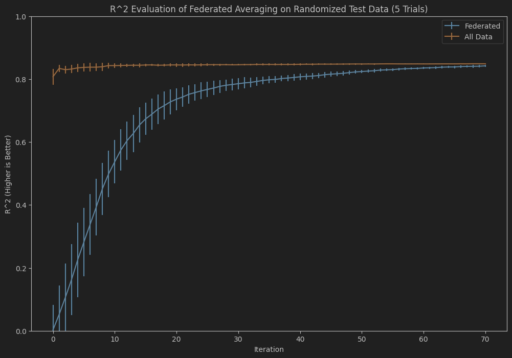

# Computer Science 6936 - Docker-Based Federated Learning
By Andrew Harris and Ali Bahari

Our project goal is to create a simulated horizontal federated learning system, with real clients & servers.
We implemented the [FedAvg](http://www.datascienceassn.org/sites/default/files/Federated%20Learning%20of%20Deep%20Networks%20using%20Model%20Averaging.pdf)
algorithm, with [Docker](https://www.docker.com/resources/what-container/) used to simulate the server & clients as containers.

## Run Instructions

For all run instructions, you will need to clone this repository with Git:

`git clone https://github.com/AndrewHarris709/comp6936-FedAvg`

### With Docker (Recommended)

1. Install Docker Desktop on your system from: https://docs.docker.com/get-started/get-docker/
2. Navigate to the cloned git directory in a command terminal.
3. Run `docker compose up`.
4. When prompted, visit `http://localhost:8000` in a web browser.

### With Bash

1. Ensure that [Python](https://www.python.org/downloads/) is installed on your system. (We used Python version 3.10.12 during development)
2. Navigate to the cloned git directory in a command terminal.
3. Install Python dependencies by running: `pip install -r requirements.txt`.
3. Run `./federated_trial.sh`.
4. After 2 seconds, visit `http://localhost:8000` in a web browser.

We do not recommend running this project on Windows outside of Docker. For some reason, the network calls between each program become very slow (1s each) on a Windows environment.

## Repository Guide

To train our client models, we used [SGDRegressor](https://scikit-learn.org/stable/modules/generated/sklearn.linear_model.SGDRegressor.html) from scikit-learn. Helper functions for interacting with scikit-learn are contained in the `linearRegression` folder. For more details on how we interface with this model and how mini-batch training is performed, [click here](linearRegression/README.md).

The server & client for our implementation of federated averaging is contained inside the `federated` folder. These files contain the details of weight averaging and model updates, separate from the network implementation. [Click here](federated/README.md) for more details.

The network interfaces for the `federated` code are available in `client.py` and `server.py`. These files are the main entry
point for the program, wrapping around `fed_client.py` and `fed_server.py` respectively. To learn more about how the network communication is implemented, [click here](network.md).

The inspector web page is done with [Dash](https://dash.plotly.com/). Code for the inspector can be found in [`dash_inspector.py`](dash_inspector.py).

Docker container specifications for running the server, clients and inspector can be found in the `docker` folder. The docker compose script which runs these together can be found in [`compose.yaml`](compose.yaml).

Code for data generation can be found inside the `generators` folder. For more details on the data generation process and how it is implemented, [click here](generators/README.md). There are also unit tests for the generation process, for details please [click here](tests/README.md).

## Results

To test our system, we ran five trials with five clients each. We compared the R^2 scores of our federated model with the R^2 of a LinearRegression model trained on all available client data. Our test dataset was an independently generated dataset, generated with the same parameters as the federated data. Averaged over several iterations, we get the following graph:

As we can see, initially the All Data model starts off much stronger than the federated model. However, as the iterations proceed, the federated performance increases to approach the "All Data" benchmark. The lines never quite cross, but the performance of federated learning is quite close. Based on these results, we believe that our model is working properly.

The data from this plot comes from our inspector tool. The data for the five trials is saved in the `analysis` folder, and the notebook used to generate this graph is in [`analysis/average_plot.ipynb`](analysis/average_plot.ipynb).

The inspector tool works very well at illustrating some of the dynamics of our system. Below is a real-time recorded video of the inspector tool in action:

We can see that the live-updating results mirror the results of the above graph, with the federated performance approaching our benchmark performance. The updates happen very quickly, about once a second. The "Reset" button will reset the entire plot, allowing for several consecutive test runs.

There is a checkbox reading "Show Clients" underneath the "Reset" and "Save" buttons, if we select this we can get an alternate view of the federated learning process:

In this view, we can see the performance of each client's model in comparison to the benchmark model. We can observe how each client's performance will stay "frozen" for a period of time, this is a result of a client not being selected by the server for a small number of iterations. However, the trend of the resulting curve is still the same as the federated model, approaching the benchmark line. This shows that our replication from server->client model is working properly.

## Future Work
To address some limitations of this project, we can work on the following items:
* We only use a Linear Regression model here, we should expand to a more capable model such as neural nets. This way, we can pick up more complex patterns in our dataset. We would also need a more sophisticated data generation procedure to take advantage of this capacity.
* One major benefit of Federated Learning is its adaptability, but we do not explore this avenue at all. It would be good to see what happens if a client disconnects, or if we have a sensor generating bad data. How would these events impact our system? And if it breaks the system, how can we make it more resilient?
* Parameters made available on the inspector tool would be nice, it would allow us to treat our system as more of a sandbox. (Similar to this interactable webpage from Google: https://pair.withgoogle.com/explorables/federated-learning/)
