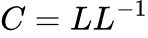

# Data Generation

For data generation, we use a procedure which involves finding the Cholesky Decomposition of a given correlation matrix. For a given correlation matrix C, Cholesky Decomposition finds a matrix L satisfying the following property:

If we multiply a set of normal random variables by matrix L, we produce a random dataset with correlation matrix C. We can use this procedure to simulate any normally-distributed dataset, given the correlation matrix.

To make our results more realistic, we include some additional parameters to alter our output:

- mults: An array of values to multiply by each variable after generation. Allows us to generate variables with non-unit standard deviations.
- shifts: An array of values to add to each variable after generation. Allows us to generate variables with non-zero mean.
- failure_rate: The ratio of values to "fail", or not be written. (This isn't applied here, instead it's applied in [fed_client.py](../federated/fed_client.py). This is still important to point out here though.)

To generate data throughout our application, we use the `CholeskyGenerator` object defined inside [`data_gen.py`](data_gen.py).

Parameters for the `CholeskyGenerator` object are defined inside a configuration file, this is located at [`../generation.config.json`](../generation.config.json). To create a new generator object based on a configuration file, we use [`from_config`](gen_io.py).

There was no single source we used for this procedure, but several stackexchange threads:
https://stats.stackexchange.com/questions/141427/how-does-the-formula-for-generating-correlated-random-variables-work?noredirect=1&lq=1
https://math.stackexchange.com/questions/446093/generate-correlated-normal-random-variables
https://stats.stackexchange.com/questions/38856/how-to-generate-correlated-random-numbers-given-means-variances-and-degree-of
