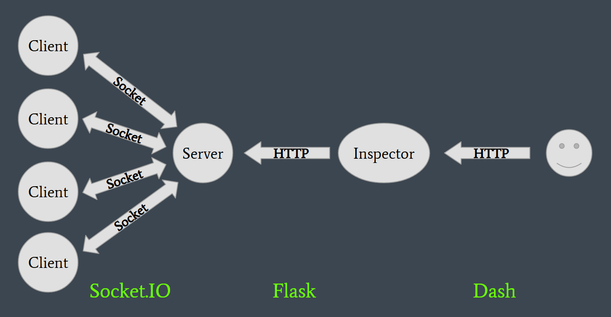

# Network Details

We use two different kinds of network connectivity in this project:

* For Server <-> Client communication, we use sockets via the [python-socketio](https://python-socketio.readthedocs.io/en/stable/) library. These sockets are good for two-way communication, which is required in the federated averaging algorithm. Messages can be sent from a client to the server, or a server to a specific (or all) clients. Implemented messages types are defined below.

* For Inspector -> Server communication, we use a [Flask](https://flask.palletsprojects.com/en/stable/) server. Endpoints
are defined in [`Server.py`](Server.py), which are accessed by the inspector. Details on available endpoints are defined below.

[`Server.py`](Server.py) must therefore host both a Flask server and be available for socket connections. Conveniently
there is a [Flask-SocketIO](https://flask-socketio.readthedocs.io/en/latest/) library which we use, combining Flask & Socket.IO functionality.

## Network Diagram

## Socket.io Messages

Socket.io messages are defined by string keywords. Below are all keywords that show up in our project.

### From Server -> Client

- `client_update`: A message to an individual client to start local training. Server weights are provided as an argument.
- `reset`: A message sent to all clients to reset their data & model. Called whenever the "Reset" button is pressed on the inspector.
- `generate_data`: A message sent to all clients to generate a new batch of data. This is defined for synchronization reasons on the inspector plot. We originally had all clients generating data on their own timestep, but this resulted in an un-synchronized graph, with several data points having the same value at a time. For testing & consistency purposes, the data generation is centralized. **This would not be used in a real-world scenario.**

### From Client -> Server
- `training_complete`: A response message sent to the server to indicate that training has completed from a `client_update` call. Local weights are sent as an argument. Weight averaging occurs when all selected clients respond with this message.
- `data_update`: A message sent to the server whenever new data is generated, containing the new data. For analysis & verification of our process, we need easy access to client data from the inspector, and this is the easiest way to do so (Otherwise we would need flask servers on all clients, or manage multiple connections from the client). All saved data is kept separate from the federated learning process. **This would never happen in a real-world scenario, as this would break the entire purpose of Federated Learning**.
- `connect`: An auto-generated message sent to the server whenever a new client connects. This allows us to have new clients joining while the server is still running.
- `disconnect`: An auto-generated message sent to the server whenever a client disconnects. This allows us to adapt to client issues, such as network failures or sensor failures.

## Flask Endpoints

Flask endpoints are HTTP addresses, specified with hierarchical extensions to the URL.

- `/` (no extension): Start a new iteration of federated learning.
- `/reset`: Clear stored data and reset all clients. Called whenever the "Reset" button is pressed on the inspector.
- `/data/all`: Get all stored client data. Again this is only for evaluation purposes, **this would never happen in a real-world scenario.**
- `/model`: Retrieve the current federated model weights.
- `/model/clients`: Get the most recent weights received from each client.
- `/generate`: Initiate a new data generation cycle.
